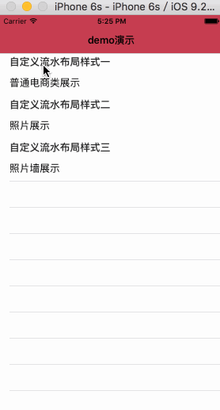

# MQWaterFlow


用UICollectionViewLayout自定义各种流式布局,实现图片的不规则排列

##垂直滚动：Vertical Scroll



具体使用将对应的Layout文件拖拽到项目中


1.导入头文件`MQWaterFlowLayout.h` 

2.遵守协议

`@interface MQWaterFlowController ()<MQWaterFlowLayoutDelegate>`

3.设置代理

```objc
    // 设置collectionView
    MQWaterFlowLayout *layout = [[MQWaterFlowLayout alloc]init];
    layout.delegate = self;
```
4.实现方法

```objc
@required
/// 返回indexPath位置cell的高度
- (CGFloat)waterFlowLayout:(MQWaterFlowLayout *)flowLayout HeightForItemAtIndexPath:(NSIndexPath *)indexPath withItemWidth:(CGFloat)width;

@optional
/// 返回显示列数
- (NSInteger)columnCountInWaterFlowLayout:(MQWaterFlowLayout *)flowLayout;
/// 返回行间距
- (CGFloat)rowMarginInWaterFlowLayout:(MQWaterFlowLayout *)flowLayout;
/// 返回列间距
- (CGFloat)columnMarginInWaterFlowLayout:(MQWaterFlowLayout *)flowLayout;
/// 返回内边距
- (UIEdgeInsets)edgeInsetsInWaterFlowLayout:(MQWaterFlowLayout *)flowLayout;

```

当不实现列数、行间距、列间距、内边距的代理方法时，会采用默认值


1.导入头文件`MQGridFlowLayout.h` 

2.遵守协议

`@interface MQGridFlowController ()<MQGridFlowLayoutDelegate>`

3.设置代理

```objc
// 设置collectionView
    MQGridFlowLayout *layout = [[MQGridFlowLayout alloc]init];
    layout.delegate = self;
```
4.实现方法

```objc
@optional
/// 返回行间距
- (CGFloat)rowMarginInWaterFlowLayout:(MQGridFlowLayout *)flowLayout;
/// 返回列间距
- (CGFloat)columnMarginInWaterFlowLayout:(MQGridFlowLayout *)flowLayout;
/// 返回内边距
- (UIEdgeInsets)edgeInsetsInWaterFlowLayout:(MQGridFlowLayout *)flowLayout;

```

当不实现行间距、列间距、内边距的代理方法时，会采用默认值


1.导入头文件`MQWaterFlowLayout.h` 

2.遵守协议

`@interface  MQWaterFlowController ()<MQWaterFlowLayoutDelegate>`

3.设置代理

```objc
    // 设置collectionView
    MQWaterFlowLayout *layout = [[MQWaterFlowLayout alloc]init];
    layout.delegate = self;

```

4.实现方法

```objc
@optional
/// 返回行间距
- (CGFloat)rowMarginInWaterFlowLayout:(MQPhotoWallLayout *)flowLayout;
/// 返回列间距
- (CGFloat)columnMarginInWaterFlowLayout:(MQPhotoWallLayout *)flowLayout;
/// 返回内边距
- (UIEdgeInsets)edgeInsetsInWaterFlowLayout:(MQPhotoWallLayout *)flowLayout;

```

当不实现行间距、列间距、内边距的代理方法时，会采用默认值
